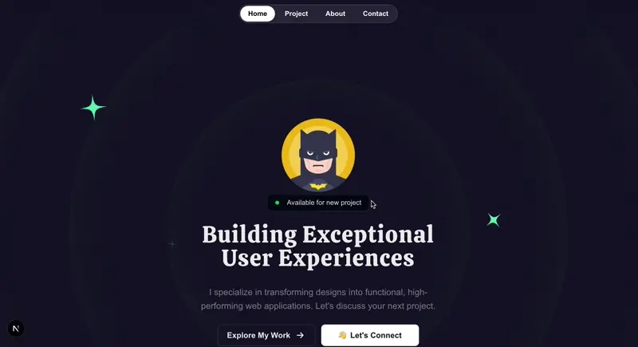
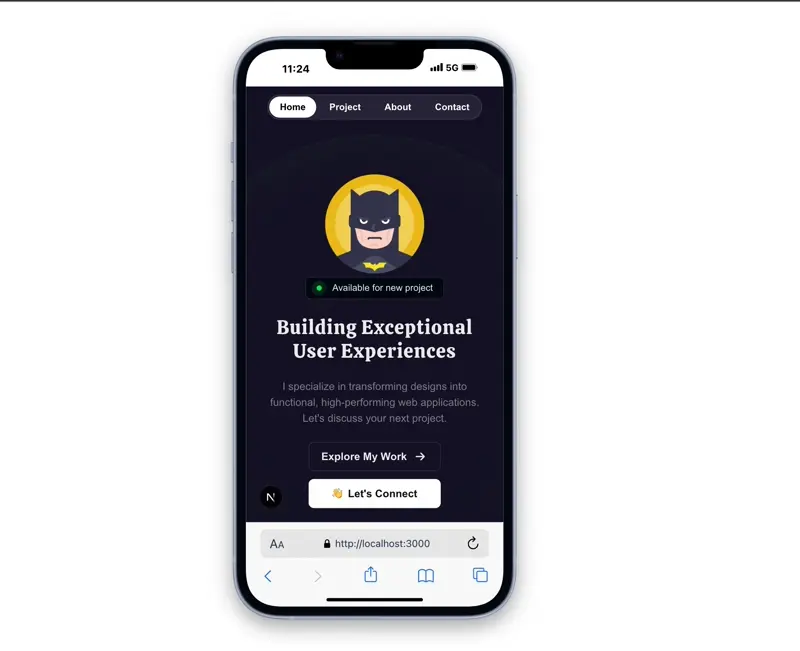

# 💼 dev_Portfolio

This is my personal developer portfolio built with [Next.js](https://nextjs.org/) and [TypeScript](https://www.typescriptlang.org/). The goal of this site is to present my professional profile, highlight selected projects, and showcase my technical skills in a clean and visually engaging way.

## 🚀 Technologies Used

- **Framework:** Next.js (App Router)
- **Language:** TypeScript
- **Animations:** [Framer Motion](https://www.framer.com/motion/)
- **Styling:** CSS and PostCSS
- **Package Manager:** npm
- **Linting:** ESLint

## 📁 Project Structure

The project is organized into the following main folders:

- `/public`: Static assets.
- `/src`: Main application code.
  - `/components`: Reusable React components.
  - `/sections`: Structured sections of the page.
  - `/types`: Type definitions used across the project.

## ✨ Features

- Smooth animations using Framer Motion and Tailwind.
- Modular and maintainable architecture.
- Fully responsive design.
- Clean, typed, and well-structured code.
