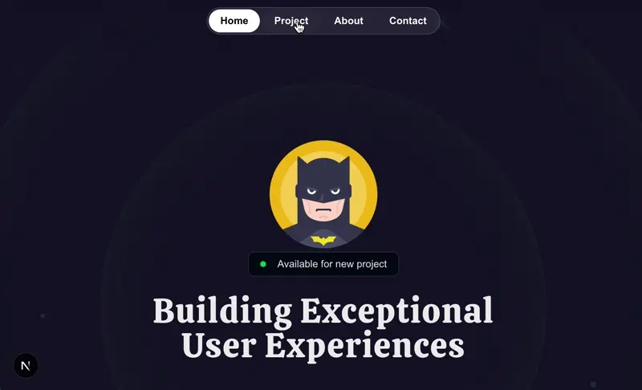

# 💼 dev_Portfolio

This is my personal developer portfolio built with [Next.js](https://nextjs.org/) and [TypeScript](https://www.typescriptlang.org/). The goal of this site is to present my professional profile, highlight selected projects, and showcase my technical skills in a clean and visually engaging way.

## 🚀 Technologies Used

- **Framework:** Next.js (App Router)
- **Language:** TypeScript
- **Animations:** [Framer Motion](https://www.framer.com/motion/)
- **Styling:** CSS and PostCSS
- **Package Manager:** npm
- **Linting:** ESLint


## 🧠 Advanced UI Techniques with Framer Motion and Tailwind

This project leverages a combination of **Framer Motion** and **Tailwind CSS** customization to create a polished, animated, and interactive interface.

### 🎯 Framer Motion – Shared Layout Animations

The navigation menu uses Framer Motion's `layoutId` feature to animate a dynamic background bubble that follows the active link.

When a user clicks on a navigation link, the `activeTab` state updates to reflect the selected section (`#home`, `#project`, etc.). The `motion.div` with `layoutId="item-bubble"` dynamically renders behind the active link, and Framer Motion smoothly animates the bubble's transition between positions.

### Highlights:

- **Shared Layout Animation**: By using the same `layoutId` across re-rendered components, Framer Motion detects changes and animates the transition.
- **Visual Feedback**: The animated white bubble behind the active link gives users clear visual feedback.
- **Performance Optimized**: Only the `motion.div` animates on state change, making the effect lightweight and responsive.

```tsx
{
  activeTab === item.href && (
    <motion.div
      layoutId="item-bubble"
      className="absolute inset-0 -z-10 bg-white rounded-full"
      transition={{ type: "spring", duration: 0.6 }}
    />
  );
}
```



- `layoutId` enables shared layout animations, allowing the background element to smoothly transition between links.

- Enhances user experience with motion that feels natural and responsive.

---

### 🎨 Tailwind CSS – Custom Class Utilities

Tailwind's `@layer` directive is used to extend utility classes for better reusability and cleaner markup.

#### `@layer base`

**@layer base**

Defines reusable custom classes such as `.nav-items` for styling navigation links with padding, rounded corners, font size, and hover effects, and `.hero-rings` to create subtle glowing ring effects with borders and shadows.

```css
@layer base {
  .nav-items {
    @apply px-4 py-1.5 rounded-full text-sm font-semibold
  text-white/70 hover:bg-white/10 hover:text-white
    transition duration-300;
  }

  .hero-rings {
    @apply absolute inset-0 border-2 top-1/2 left-1/2 -translate-x-1/2 -translate-y-1/2 rounded-full border-emerald-300/5 shadow-[0_0_80px_inset] shadow-emerald-300/5 -z-27;
  }
}

@layer utilities {
  .container {
    @apply lg:max-w-6xl mx-auto;
  }
}

@theme {
  --animate-ping-sm: ping-sm 1s ease-in-out infinite;

  @keyframes ping-sm {
    75%,
    100% {
      transform: scale(1.5);
      opacity: 0;
    }
  }

  --animate-ping-lg: ping 1s ease-in-out infinite;

  @keyframes ping {
    75%,
    100% {
      transform: scale(3);
      opacity: 0;
    }
  }

  --animate-move-left: move-l 1s linear infinite;

  @keyframes move-l {
    0% {
      transform: translateX(0%);
    }
    100% {
      transform: translateX(-50%);
    }
  }

  --animate-move-right: move-r 1s linear infinite;

  @keyframes move-r {
    0% {
      transform: translateX(-50%);
    }
    100% {
      transform: translateX(0%);
    }
  }
}
```

These techniques demonstrate a refined use of motion and utility-first design, keeping the UI performant, consistent, and easy to maintain.

## 📁 Project Structure

The project is organized into the following main folders:

- `/public`: Static assets.
- `/src`: Main application code.
  - `/components`: Reusable React components.
  - `/sections`: Structured sections of the page.
  - `/types`: Type definitions used across the project.


## ✨ Features

- Smooth animations using Framer Motion and Tailwind.
- Modular and maintainable architecture.
- Fully responsive design.
- Clean, typed, and well-structured code.
